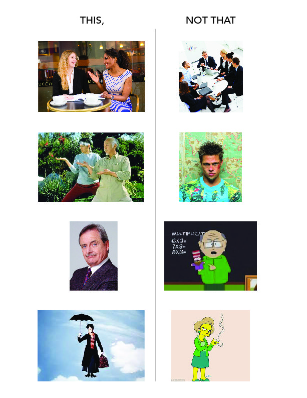

# Project Name(still working on the name)

## History and Intro

Mentoring has existed since the Ancient Greek times, and the word was inspired 
by the character in Homer's Odyssey. Historical mentorship systems include the guru - disciple tradition practiced in Hinduism and Buddhism, Elders, the discipleship system practiced by the Christian church and Rabbinical Judaism, and apprenticeship in the medieval guild system.

In the U.S. mentorship has become popular as a pathway to success for career climbers and has also been helpful in the career advancement of women and minorities.

When I had a textile and design studio, I mentored a couple of elementary school girls through the Little Artist, Big Artist program. It was a very rewarding experience for me to be able to share my skills and knowledge.   

Now that I'm making a career change, I've been seeking a mentor to help guide me through the process. It is very challenging to seek out a stranger as a design/developer mentor. As someone looking for a mentor, I don't want to seem like a creep or bother anyone, I genuinely want some guidance about the field from anyone who is willing to share it.  

Austin, Texas has a great Design and Development community that is open to sharing knowledge. I plan on creating a platform where Austin Design and Development professionals who are interested in being mentors and sharing their industry knowledge and skills can be paired with students, young professionals and others who are seriously interested in learning. Then the mentees can pay it forward and become mentors, creating a cycle of knowledge sharing.

Like the old adage says, "Teach a man to fish, and you feed him for a lifetime"

## Project Issues and Goals
Potential issues:
How to curate pairings of mentors and mentees so that useful and helpful pairings are made. Keeping the app useful and helpful for users so that user base doesn't fall.   

Goals:
Create a better Design/Developer community by helping others.
Turn mentees into mentors, continuing the knowledge sharing. 
Give industry leaders opportunity to be mentors. 
Bring element of delight to site, encouraging users to mentor.
Create incentives for users to mentor. 

## Audience
Austin Designers/Developers who care about helping others interested in their field and are willing to take the time to share their knowledge.  

Students, young professionals, people interested in making a transition into the field or struggling in the field and looking for a mentor.  

## Competitive Market Study
What are we doing right?
A curated mentorship app does not currently exist in the Austin market, first of it's kind. 

Coffee Meets Bagel
A dating app that sends a potential bagel/match daily, user can pass or take. 
Connects with facebook to match with friends of friends for better pairings. 
User can give bagels to friends. Users can earn beans/incentives with more usage of the site or have the option to buy more beans to unlock more features.

## SWOT Analysis
### Strengths
- A platform for mentors to share industry knowledge and skills 
- Mentors can find mentees
- Mentees can find mentors
- creates helpful community

### Weaknesses
- Goals of mentors and mentees not met
- Curated pairings not helpful or interesting
- Too many mentees and not enough mentors
- Too many mentors and not enough mentees

### Opportunities
- A curated mentorship app does not currently exist in the Austin market
- Mentees can turn into mentors
- App can be used/endorsed by local organizations
- Incentives for being a mentor, get to invite others 

### Threats
- User base falls off because of unhelpful pairings
- A competitor creates a better product

## Keywords
share, help, connect, mentor, mentee, community, wise, trusted, counselor,
influential, supporter, adviser, master, guide, preceptor, role model, legacy, protege, coach, leader, expert, professional, inspiring, supportive, engaging, success, goals, community, collaborate, nurturing, experience, advice, guidance, assistance, knowledge, connect, invest, inform, potential, talent, credible, trustworthy, senior, junior, open, willing, listen, respect, growth, peer, formal, informal, developmental, learn, evolve, explore, teach, skills, perspective, empathy, honest, passion, apprentice, guild, guru, disciple, relationship, communication, reassurance, confidence, time, commitment, work ethic, challenges

## "This not that"

## Game Plan
Use research and word lists to come up with names for the site. Conduct user surveys to find out what qualities and skills people look for in mentors and what skills and qualities mentors look for in mentees. Create user personas of users of the site to help figure out site content. Create a site map to categorize and prioritize content. Create style tiles to explore options for look, feel and tone for the site. Create a logo and icons in Illustrator that reflect the look, feel and tone using a morphological matrix with associated words.Create wireframes in Illustrator to explore layout possibilities. Then create low fidelity comps in Photoshop before moving on to HTML and CSS. 

## Project Deliverables
Research, word lists, user surveys and personas, site map, style tiles, logo and icons, wireframes, low fidelity comps.
